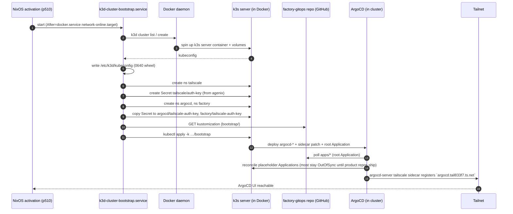

# Bootstrap Flow

What happens between "I rebooted p510" and "ArgoCD UI is reachable on
the tailnet".

## Sequence

## Idempotency / re-runs

Every step in the bootstrap script uses `kubectl apply` (not `create`)
and `k3d cluster list` checks. Safe to:

- Restart the unit at any time: `systemctl restart k3d-cluster-bootstrap`
- Bounce the host: cluster persists in Docker volumes; bootstrap re-runs
- Run with the agenix secret missing: cluster comes up, bootstrap logs a
  warning, no Secret seeded. Add the secret and restart the unit.

What's **not** idempotent: deleting `/mnt/img_pool/k3d/storage`. That
wipes PV data; ArgoCD reconciles workloads, but PVC-backed state is
gone forever.

## Failure modes

| Symptom | Likely cause |
|---|---|
| Bootstrap log: "k3d cluster create failed" | Docker daemon not ready (`requires=docker.service` should prevent this; check `systemctl status docker`) |
| Bootstrap log: "auth-key not readable" | agenix secret not created yet — `manage-secrets.sh edit tailscale-k8s-operator-oauth` on nixos_config, redeploy p510 |
| Bootstrap log: "kustomize build failed" / "not found" | This repo's `bootstrap/` is broken or branch doesn't exist. Test locally: `kustomize build https://github.com/olafkfreund/factory-gitops//bootstrap?ref=main` |
| ArgoCD UI 404 / connection refused on tailnet | Sidecar hasn't registered yet (`kubectl -n argocd logs deploy/argocd-server -c tailscale`) OR the TS_AUTHKEY in `argocd/tailscale-auth-key` is stale (key rotation needed) |
| Sidecar logs "auth key invalid" | Key expired or revoked → [operating.md → rotation](operating.md#auth-key-rotation) |
